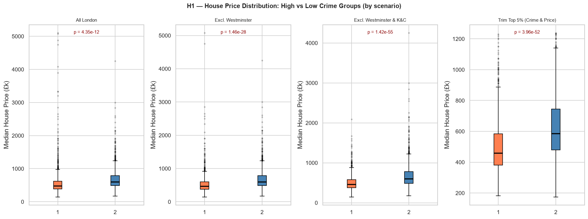
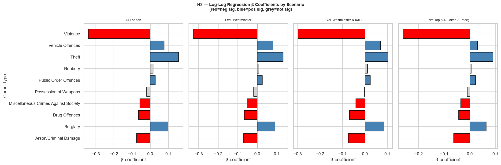

# Crime Analysis and Statistical Inference Report

## Crime and House Prices Across London LSOAs (2022)

This analysis examines the relationship between recorded crime and median house prices across **4,757 London LSOAs**. To test whether the results were influenced by unusual areas, the analysis was repeated using four scenarios: All London, Excluding Westminster, Excluding Westminster & Kensington and Chelsea, Excluding the top 5% of crime and house-price values.

---

## Task 1: Exploratory Data Analysis

The distributions of both median house prices and total crime are right-skewed. Across all London LSOAs, total crime had a very weak positive correlation with median house price. However, the relationship changed when influential areas were excluded. The correlation became negative after removing Westminster and became increasingly negative after further exclusions.

These results suggest that the overall London relationship is affected by a small number of influential areas with unusual combinations of crime and property prices.

---

## Task 2: Hypothesis Testing

### Hypothesis 1: Do high-crime areas have lower house prices?

The analysis compared the top 25% and bottom 25% of LSOAs by crime level within each scenario. A one-tailed t-test was used to test whether high-crime areas had lower mean house prices.

The null hypothesis was rejected in all four scenarios (**p < 0.001**).

The results consistently show lower house prices in the high-crime group. The largest difference occurred after excluding Westminster and Kensington and Chelsea.

### Hypothesis 2: Are individual crime categories associated with house prices?

A multiple log-log regression was used to examine the ten crime categories simultaneously. The models explained between **24.9% and 29.3%** of the variation in log house prices across the four scenarios.

---

## Task 3: Correlation and Regression Analysis

The correlation analysis showed that crime categories have different relationships with house prices. **Violence Against The Person** had the strongest negative correlation with house prices.

Overall, the results in the multiple regression models suggest that **the type of crime is more informative than total crime alone** when examining differences in London house prices. The results also show that the apparent relationship between total crime and house prices changes substantially when influential areas are excluded.

---

## Conclusion

The analysis found three main results:

1. **Total crime alone has a weak relationship with house prices**, and the direction of the relationship changes when influential areas are excluded.
2. **High-crime areas have significantly lower average house prices** across all four scenarios.
3. **Different crime categories have different relationships with house prices**, with violent crime showing the most consistent negative association.

The results demonstrate the importance of considering spatial outliers and crime composition when analysing the relationship between crime and property prices across London.
