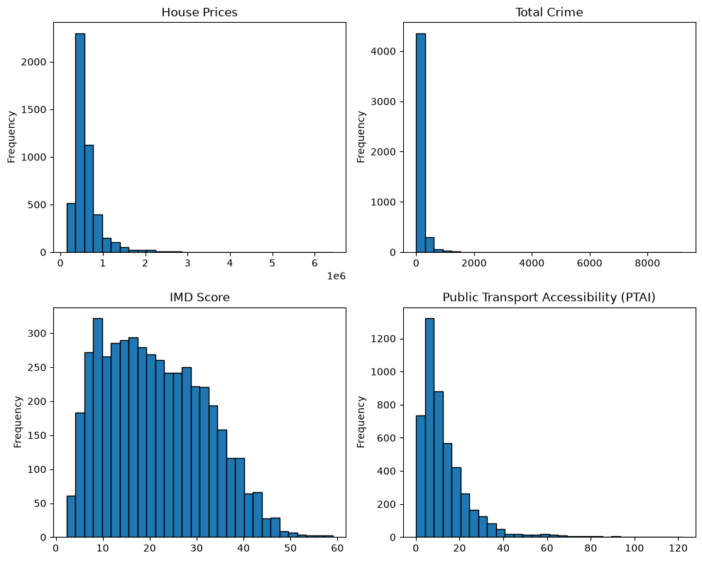
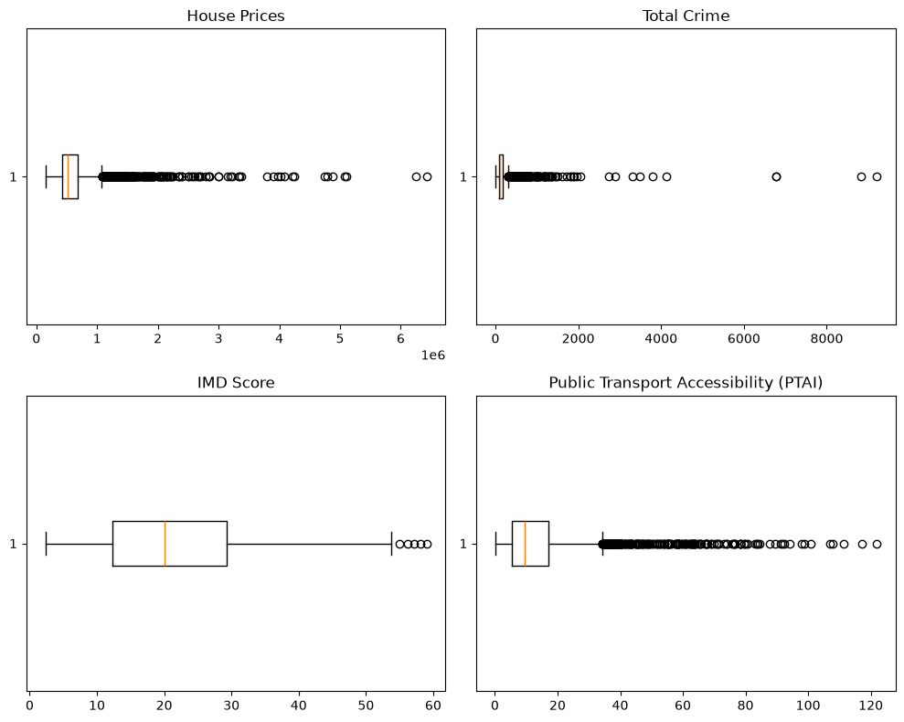
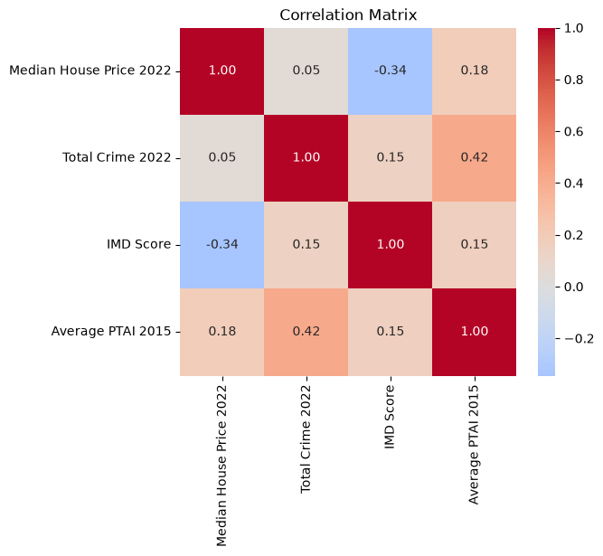

# Neighbourhood Characteristics and House Prices

Our project investigates which neighbourhood characteristics are most strongly associated with house prices across London. By analysing data at the Lower Layer Super Output Area (LSOA) level, we compare approximately 4,800 neighbourhoods, providing sufficient observations for robust exploratory analysis and later statistical modelling.

---

# Task 1: Identify a Real-World Problem

## Problem Statement

House prices vary considerably across London, but affordability is influenced by much more than location alone. Crime, deprivation and access to public transport all contribute to the attractiveness and value of a neighbourhood.

The aim of this project is to investigate which neighbourhood characteristics are associated with house prices and identify areas that may offer better value for money.

## Stakeholders

The findings of this project could benefit:

- Home buyers
- Property investors and developers
- Urban planners
- Local authorities
- Housing policy makers

---

# Task 2: Data Selection

To investigate the factors associated with house prices, four publicly available datasets were selected. Together, they provide information on property values, crime, deprivation and transport accessibility at the LSOA level.

## Datasets Selected

### 1. Median House Prices (ONS)

- **Source:** Office for National Statistics (ONS)
- **Level:** LSOA
- **Period:** 1995–2023

The median house price dataset was selected instead of borough-level averages because it provides much greater geographical detail and reduces the influence of extremely expensive properties.

**Dataset:** *HPSSA Dataset 46 - Median price paid for residential properties by LSOA*

https://www.ons.gov.uk/peoplepopulationandcommunity/housing/datasets/medianpricepaidbylowerlayersuperoutputareahpssadataset46

---

### 2. Metropolitan Police Crime Data

- **Source:** London Datastore
- **Level:** LSOA
- **Period used:** January–December 2022

This dataset contains monthly recorded crime counts by offence category, allowing both overall crime levels and individual crime types to be analysed.

**Dataset:** *MPS LSOA Level Crime (Historical)*

https://data.london.gov.uk/dataset/recorded_crime_summary

---

### 3. English Indices of Multiple Deprivation (IMD)

- **Source:** UK Government
- **Level:** LSOA
- **Year:** 2019

The IMD provides an official measure of relative deprivation across England using indicators covering income, employment, education, health, crime, housing and the living environment.

**Dataset:** *File 7: All IoD2019 Scores, Ranks, Deciles and Population Denominators*

https://www.gov.uk/government/statistics/english-indices-of-deprivation-2019

---

### 4. Public Transport Accessibility Levels (PTAL)

- **Source:** London Datastore
- **Level:** LSOA
- **Year:** 2015

PTAL measures accessibility to London's public transport network and is widely used as an indicator of transport connectivity.

**Dataset:** *LSOA2011 Average PTAI 2015*

https://data.london.gov.uk/dataset/public-transport-accessibility-levels

---

## Justification

Using data at the LSOA level increases the number of observations from approximately 33 London boroughs to around 4,800 neighbourhoods. This level of granularity allows a much richer exploratory analysis and provides sufficient observations for robust statistical modelling in the later stages of the project.

## Data Preparation Challenges

### Temporal Differences

The datasets originate from different years:

- PTAL (2015)
- IMD (2019)
- Crime (2022)
- House Prices (2022)

This analysis assumes that transport accessibility and deprivation change relatively slowly over time compared with annual house prices.

### Geographic Code Differences

The crime dataset uses **LSOA 2021** codes, whereas the house prices, IMD and PTAL datasets use **LSOA 2011** codes. To ensure geographical consistency across all datasets, the official **ONS LSOA 2021 to LSOA 2011 Best Fit Lookup** was used.

The lookup introduced two mapping challenges:

- **One LSOA 2021 to multiple LSOA 2011:** 119 LSOA 2021 codes mapped to multiple 2011 LSOAs. In these cases, crime counts were divided equally between the corresponding LSOA 2011 areas to avoid double counting while retaining all observations.

- **Multiple LSOA 2021 to one LSOA 2011:** where several 2021 LSOAs mapped to a single 2011 LSOA, crime counts were aggregated to preserve the total number of recorded offences.

A further 181 London LSOAs could not be uniquely matched using the Best Fit Lookup. Rather than excluding these areas, the **ONS Postcode Directory** was used to assign each LSOA 2021 to the LSOA 2011 containing the majority of its constituent postcodes, minimising data loss while maximising geographical coverage.

---

# Task 3: Exploratory Data Analysis (EDA)

Exploratory Data Analysis (EDA) was conducted to gain an initial understanding of the datasets, assess their overall quality, identify potential issues and explore relationships between variables before completing the data cleaning process.

The exploratory analysis began by examining the structure of each dataset, including the number of observations, variable types, duplicate records and missing values. This assessment identified several data quality challenges, including suppressed house price values, differences in geographical coding systems, temporal inconsistencies between datasets and missing crime data for a small number of LSOAs. These findings informed the data cleaning decisions described in the following section.

Summary statistics and distribution plots were used to understand the distributions of the principal numerical variables. House prices and crime counts showed substantial variation across London, with positively skewed distributions resulting from a relatively small number of neighbourhoods exhibiting exceptionally high values. In contrast, deprivation scores displayed a more balanced distribution, while public transport accessibility showed moderate positive skewness.

boxplots highlight several outliers, particularly for house prices, crime and transport accessibility. The highest house prices were concentrated in central London boroughs such as Kensington and Chelsea and Westminster, while the highest crime levels were also observed in Westminster, reflecting the concentration of commercial activity, tourism and major transport hubs. As these values represent genuine characteristics of the London housing market rather than data entry errors, they were retained for subsequent analysis.

Correlation analysis was performed to explore the relationships between the principal variables. A moderate negative relationship was observed between house prices and deprivation, indicating that more deprived neighbourhoods generally have lower property values. Public transport accessibility showed a weak positive relationship with house prices (r = 0.18), while total crime exhibited almost no linear relationship (r = 0.05). The relatively weak association between crime and house prices is likely influenced by central London neighbourhoods, particularly Westminster, where both property values and recorded crime levels are exceptionally high. These observations provide useful context for the statistical modelling undertaken in the later stages of the project.

---

# Task 4: Data Cleaning

Several preprocessing steps were carried out to produce a single analysis-ready dataset.

## Crime Dataset

The crime dataset was filtered to include offences recorded between January and December 2022. Monthly crime counts were aggregated into annual totals for each LSOA.

Crime categories were pivoted into separate variables, and an additional **Total Crime 2022** feature was created by summing all crime categories.

## House Price Dataset

Suppressed house price values (`:`) were converted to missing values before all quarterly house price columns were converted to numeric format.

Missing values in the December 2022 house price data were assessed using historical quarterly house price observations from **March 2016 to September 2022**.

LSOAs with no historical house price information were first identified and removed.

- **22 rows** had no historical observations and were excluded.

For the remaining missing values, estimates were generated using two approaches:

- **Interpolation** between the closest available previous observation (not earlier than December 2017) and March 2023 where available.
- **Average quarterly growth rates** calculated from recent historical observations where interpolation was not possible.

Following imputation, LSOAs with insufficient recent information were identified.

- **53 LSOAs** had no house price data since December 2020 and were removed to avoid producing unreliable estimates.

This process ensured that only neighbourhoods with sufficient recent historical information were retained for analysis.

## Dataset Integration

The cleaned house prices, crime, IMD and PTAL datasets were merged using the common LSOA 2011 geographical identifier.

Following the merge:

- duplicate columns created during merging were removed;
- variables were renamed for clarity;
- columns were reordered into a logical structure; and
- the final analytical dataset was created.

Overall, 78 LSOAs (1.61% of the dataset) were removed during the data preparation process . Of these, 22 were excluded because no historical house price data were available, and a further 53 were removed because they lacked any house price observations since December 2020, making reliable imputation impossible. The remaining 3 LSOAs correspond to the City of London, which is policed by the City of London Police rather than the Metropolitan Police Service and therefore has no corresponding records in the MPS crime dataset.

## Data Quality Assessment

The datasets were generally of high quality but required several preprocessing steps before they could be integrated into a single analytical dataset.

The principal data quality issues identified were:

- differing geographical coding systems across datasets;
- temporal differences between data sources;
- suppressed house price values;
- incomplete historical house price information for a small number of LSOAs; and
- missing crime data for the three City of London LSOAs, which fall outside the Metropolitan Police Service jurisdiction.

These issues were addressed through geographical code conversion, systematic handling of missing values and careful data integration. The resulting dataset is geographically consistent, internally coherent and suitable for the statistical analysis and modelling undertaken in the subsequent stages of the project.