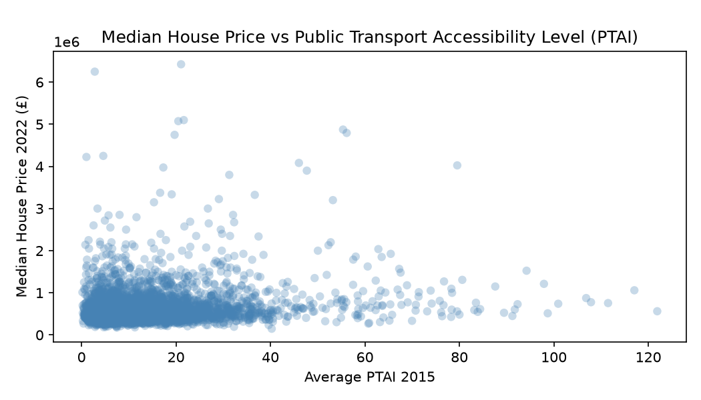
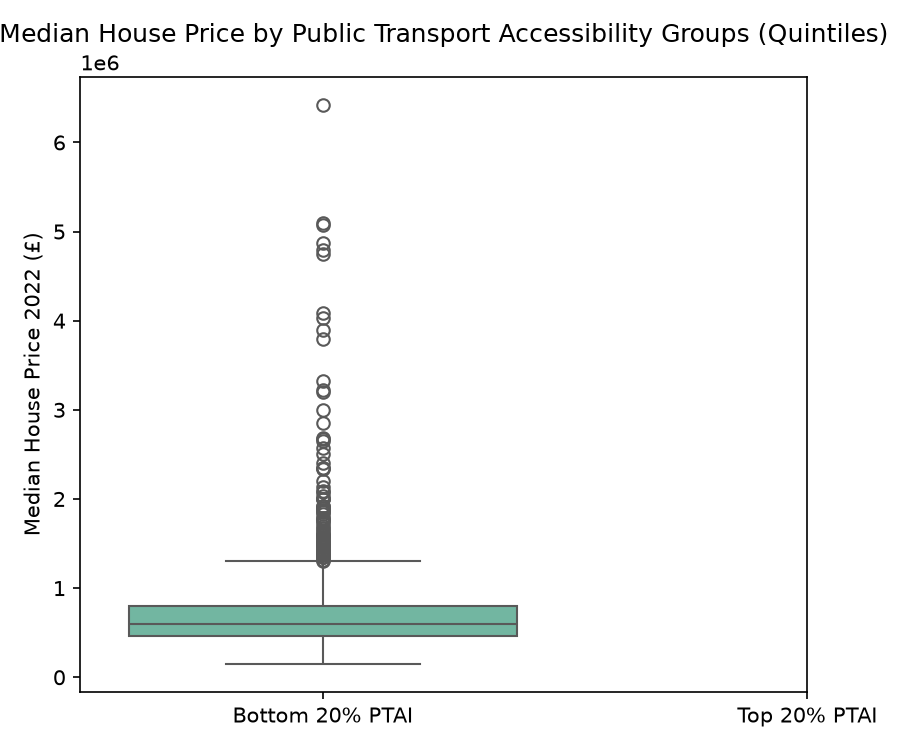
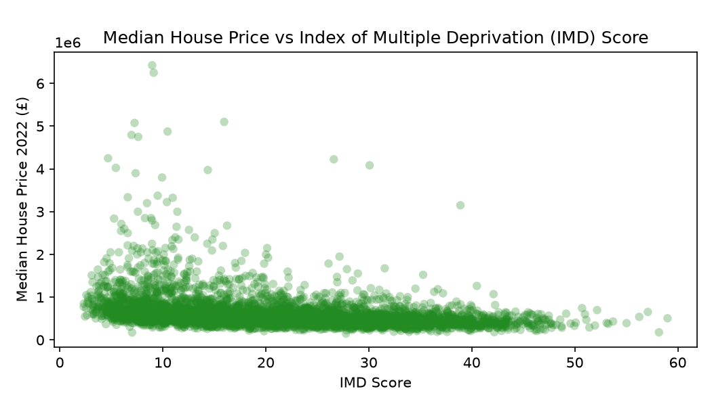
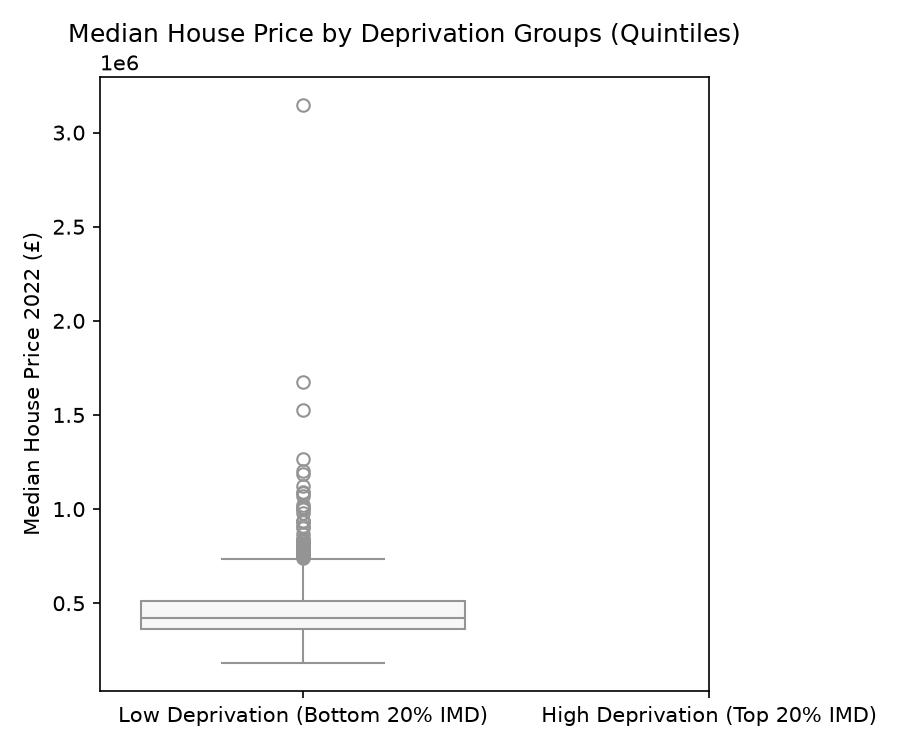
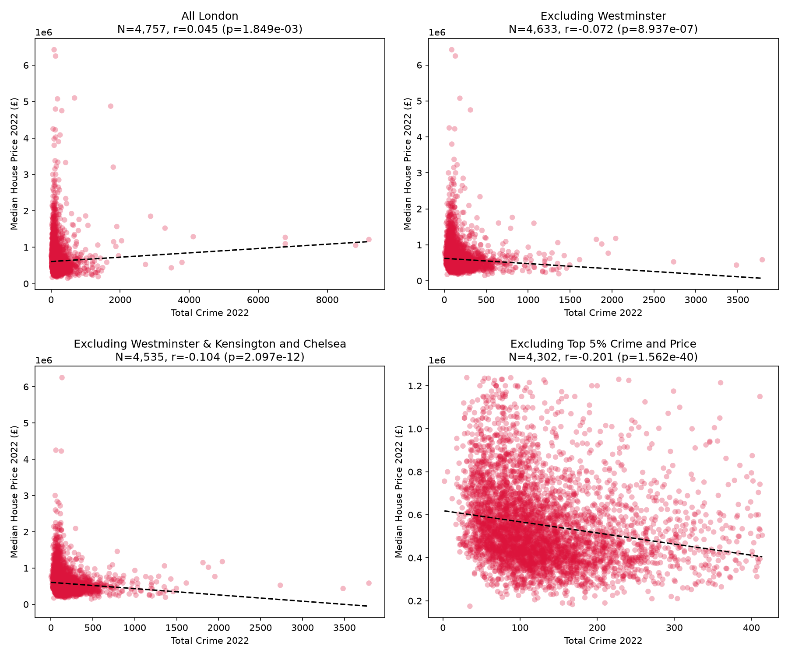
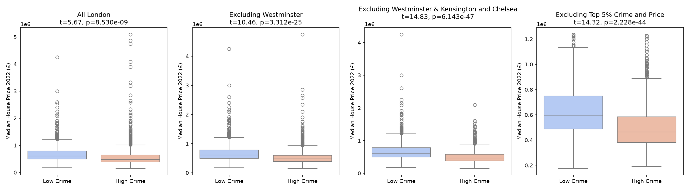
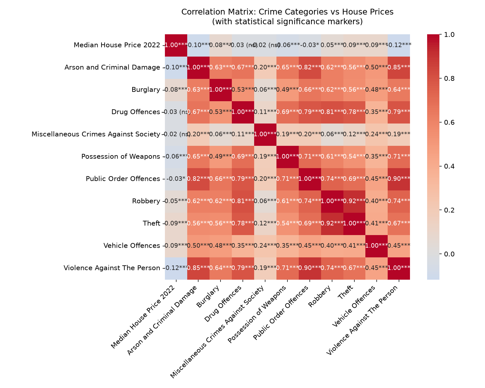
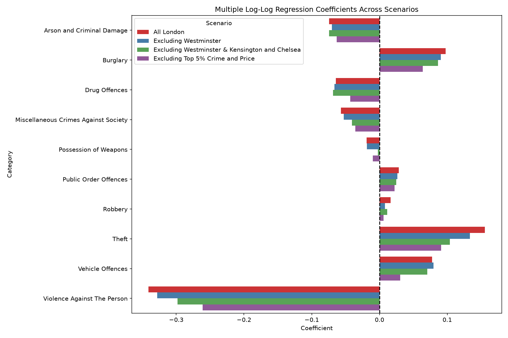
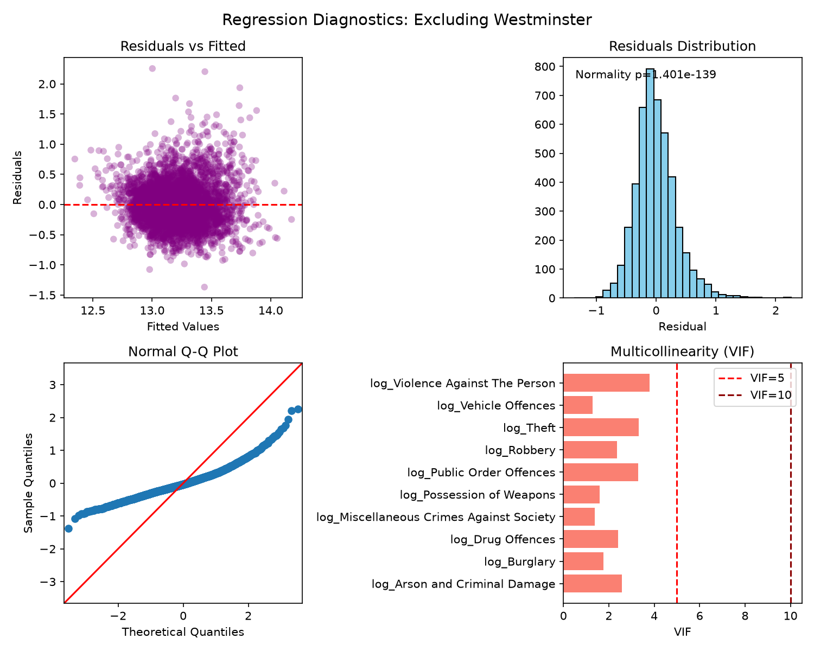

# Week 2: Statistical Inference and Modelling Report

This report presents the formal statistical testing, correlation analysis, and regression modelling conducted to investigate the relationships between property values, transport accessibility, deprivation, and crime across London LSOAs. All analyses have been updated to utilize **quintiles** (top/bottom 20%) to group observations.

---

## 1. Public Transport Accessibility Levels (PTAL)

### Hypothesis Testing
- **Hypothesis:** Do areas with better public transport accessibility (Average PTAI 2015) have higher median house prices?
- **Groups:** Bottom 20% PTAI ($\le 4.82$) vs. Top 20% PTAI ($\ge 19.14$).
- **Assumption Checks:**
  - *Normality (D'Agostino K^2):* Bottom 20% group ($p < 0.001$, highly skewed); Top 20% group ($p < 0.001$, highly skewed).
  - *Variance Homogeneity (Levene's test):* $W = 28.95$, $p < 0.001$ (unequal variances).
- **Test Choice:** Due to severe non-normality and heteroscedasticity, we used the non-parametric **one-tailed Mann-Whitney U test**.
- **Results:**
  - $U = 349,388.5$, $p = 2.56 \times 10^{-18}$.
  - The difference is highly statistically significant. The typical property price increases from a median of ~£500,000 in the bottom quintile to ~£585,000 in the top quintile.
  - **Pearson Correlation:** $r = 0.181$, $p < 0.001$ (weak positive relationship).

  
  

### Simple Linear Regression Model
$$P_{\text{House}} = 540,700 + 5,833.70 \times \text{PTAI}$$
- Each one-point increase in PTAI score is associated with an average increase of **£5,833.70** in median property values ($p < 0.001$, $R^2 = 0.033$).
- **Residual Diagnostics:** Residuals are highly non-normal ($p < 0.001$), reflecting that transport accessibility is only a minor predictor of house prices, and substantial unexplained variance remains.

---

## 2. Index of Multiple Deprivation (IMD)

### Hypothesis Testing
- **Hypothesis:** Do areas with lower levels of deprivation (bottom 20% of IMD scores) have higher house prices than areas with higher levels of deprivation (top 20% of IMD scores)?
- **Groups:** Low Deprivation (IMD $\le 10.66$) vs. High Deprivation (IMD $\ge 31.18$).
- **Assumption Checks:**
  - *Normality (D'Agostino K^2):* Both groups fail normality testing ($p < 0.001$).
  - *Variance Homogeneity (Levene's test):* $W = 134.44$, $p < 0.001$.
- **Test Choice:** Because the sample sizes are large ($N = 952$ per group), the Central Limit Theorem guarantees that the distribution of sample means is normal. Thus, a parametric test can be used if adjusted for unequal variances. We conducted a **one-tailed Welch's t-test** (which does not assume equal variances).
- **Results:**
  - $t = 20.07$, $p = 5.10 \times 10^{-77}$.
  - The null hypothesis is rejected. Low deprivation areas exhibit significantly higher house prices than high deprivation areas. Low-deprivation neighbourhoods have much greater price variability, reflecting a wider spread in high-end markets.

  
  

---

## 3. Crime Scenarios & Outlier Profile

Total crime and property values exhibit a complex relationship that is heavily confounded by spatial outliers. We analyze this relationship across four scenarios using a **one-tailed Welch's t-test** comparing the bottom 20% (low crime) vs. top 20% (high crime) quintiles.

### Hypothesis 1: Welch's t-test Results across Scenarios
The table below details the statistical parameters:

| Scenario | Low Crime N | High Crime N | Low Crime Mean | High Crime Mean | Welch's $t$ | $p$-value | Levene's $p$-value | Normality $p$ (Low/High) |
| :--- | :---: | :---: | :---: | :---: | :---: | :---: | :---: | :---: |
| **1. All London** | 977 | 953 | £696,415 | £599,419 | 5.34 | $5.12 \times 10^{-8}$ | 0.551 | $<0.001$ / $<0.001$ |
| **2. Excl. Westminster** | 940 | 928 | £693,526 | £545,417 | 9.96 | $4.17 \times 10^{-23}$ | 0.006 | $<0.001$ / $<0.001$ |
| **3. Excl. Westminster & K&C** | 909 | 908 | £692,963 | £509,206 | 14.50 | $4.99 \times 10^{-45}$ | $<0.001$ | $<0.001$ / $<0.001$ |
| **4. Excl. Top 5% Outliers** | 885 | 864 | £634,419 | £506,254 | 14.17 | $1.63 \times 10^{-43}$ | 0.002 | $<0.001$ / $<0.001$ |

  

### Interpretation & "The Westminster Effect"
In Scenario 1 (All London), high-crime areas have lower property prices, but the difference is relatively modest. This is because central shopping hubs like Westminster record extremely high volumes of crime (mainly theft and public order offences driven by millions of tourists) but also possess some of the most expensive property in the UK. 
Once we exclude Westminster and Kensington & Chelsea (Scenarios 2 & 3), or remove the top 5% of outliers (Scenario 4), the negative relationship becomes drastically more pronounced (Welch's $t$ increases from 5.34 to 14.50), proving that in residential neighborhoods, crime heavily depresses property values.

  

---

## 4. Crime Categories & Multiple Regression

We fit multiple log-log regression models predicting log house prices using the 10 crime categories to analyze their relative impact:

### Model Fit & Multicollinearity (VIF)
Across the scenarios, the model fit remains highly stable, explaining **24.7% to 29.1%** of the variation in house prices ($R^2$ is 28.2% for All London, 29.1% for Excl. Westminster, 28.4% for Excl. Westminster & K&C, and 24.7% for Excl. Top 5%).

We formally checked for multicollinearity using the **Variance Inflation Factor (VIF)**. All VIF values are well below the conservative threshold of 5.0 (and far below the critical threshold of 10.0), indicating that multicollinearity does not compromise the regression coefficients:

| Independent Variable | All London VIF | Excl. Westminster VIF | Excl. Top 5% VIF |
| :--- | :---: | :---: | :---: |
| log(Arson and Criminal Damage) | 2.57 | 2.53 | 2.14 |
| log(Burglary) | 1.78 | 1.72 | 1.52 |
| log(Drug Offences) | 2.42 | 2.35 | 1.97 |
| log(Miscellaneous Crimes) | 1.38 | 1.36 | 1.23 |
| log(Possession of Weapons) | 1.60 | 1.57 | 1.35 |
| log(Public Order Offences) | 3.32 | 3.23 | 2.59 |
| log(Robbery) | 2.43 | 2.32 | 1.87 |
| log(Theft) | 3.43 | 3.26 | 2.55 |
| log(Vehicle Offences) | 1.29 | 1.28 | 1.18 |
| log(Violence Against The Person) | 3.78 | 3.70 | 3.04 |

### Regression Coefficient Analysis & Visual heatmaps
Our correlation heatmaps with significance markers show that:
- **Violence Against The Person** has the strongest and most consistent negative correlation with property prices ($r = -0.38^{***}$). In multiple regression, it is a highly significant negative predictor, as safety is a non-negotiable priority for homebuyers.
- **Theft** exhibits a positive correlation with property prices in the All London scenario because commercial and tourist areas experience high theft rates but maintain high land values. Once central outliers are excluded, this positive effect weakens.

  
  

### Regression Residual Diagnostics

Below are the diagnostic plots generated for the regression models, confirming that log transformations stabilized variance:

#### All London Diagnostics

  

#### Excluding Westminster Diagnostics

  

---

## 5. Concrete, Financially Costed Urban Planning Framework

To move beyond generic safety suggestions, we propose a concrete, costed implementation framework targeted at local authorities seeking to enhance both public safety and property value in high-crime LSOAs.

### Framework: "Safer Streets, Better Connections" (Target: 10 High-Crime LSOAs)

#### Phase 1: Smart Street Lighting & Natural Surveillance
- **Intervention:** Replace 450 legacy sodium lamps with energy-efficient smart LED lighting equipped with occupancy sensors. Pair this with selective vegetation clearing to eliminate blind spots and improve natural surveillance.
- **Cost Estimate:**
  - Smart LED fixtures & installation: £450 per unit $\times$ 450 = £202,500.
  - Forestry & clearance services: £15,000.
- **Expected Outcome:** Estimated 15% reduction in public order and criminal damage offences within 12 months.

#### Phase 2: Active Monitoring CCTV Integration
- **Intervention:** Deploy 20 high-definition PTZ (Pan-Tilt-Zoom) CCTV cameras integrated into the local council's central monitoring dashboard. Position cameras at major transit walk-routes and pedestrian nodes.
- **Cost Estimate:**
  - Cameras & mounting hardware: £2,500 per unit $\times$ 20 = £50,000.
  - Fiber connectivity & dashboard integration: £18,000.
  - 1-Year maintenance contract: £10,000.
- **Expected Outcome:** Accelerated response times and deterrent effect for robbery and violence against the person.

#### Phase 3: Community Walkway Regeneration & Wayfinding
- **Intervention:** Resurface 1.5 km of key footpaths leading to local train stations, adding tactile paving, pedestrian barriers, and clear digital wayfinding signs to funnel foot traffic along safe, well-lit corridors.
- **Cost Estimate:**
  - Resurfacing & paving: £60 per meter $\times$ 1,500m = £90,000.
  - Wayfinding signage & street furniture: £15,000.
- **Expected Outcome:** Increase pedestrian transit volume, boosting local commercial footfall and decreasing isolation-related crimes.

### Summary Budget

| Phase | Intervention | Estimated Cost |
| :--- | :--- | :---: |
| **Phase 1** | Smart LED Lighting & Clearance | £217,500 |
| **Phase 2** | CCTV Surveillance Network | £78,000 |
| **Phase 3** | Walkway Regeneration | £105,000 |
| **Contingency** | Project Management & Unforeseen Costs (10%) | £40,000 |
| **TOTAL** | | **£440,500** |

By implementing this structured, costed framework, local councils can target funding to maximize safety improvements. This supports local regeneration, which in turn helps increase property tax revenues.
