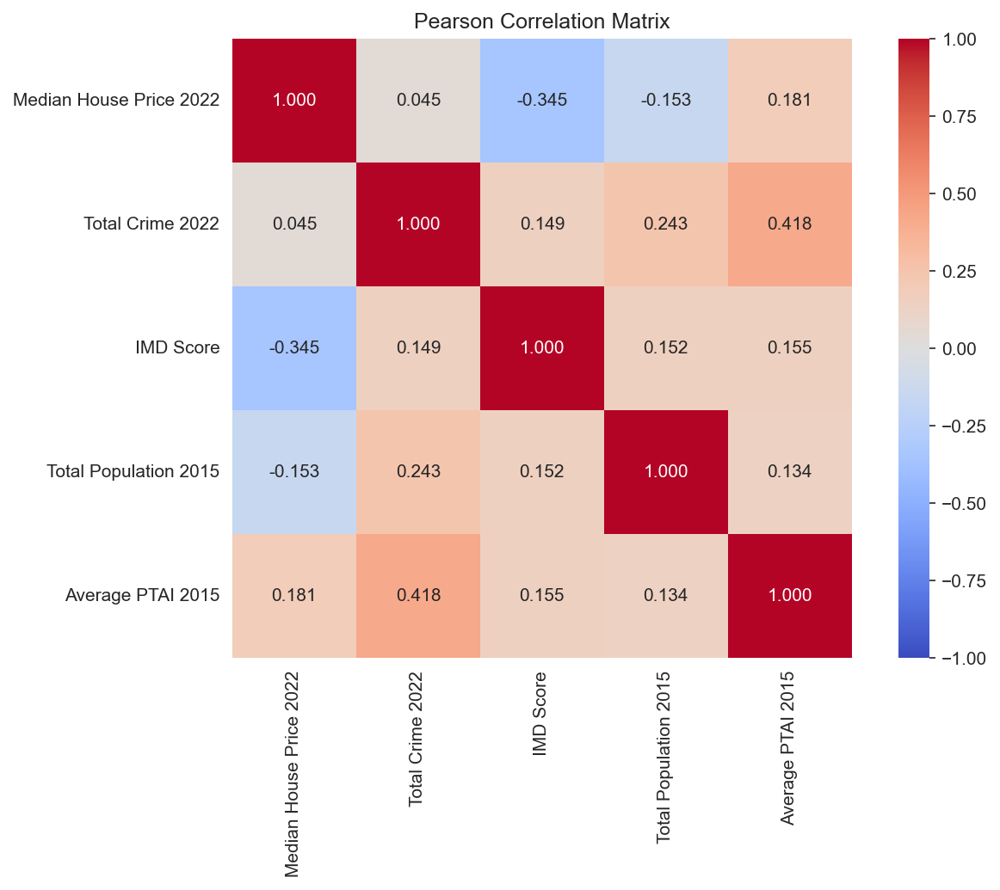
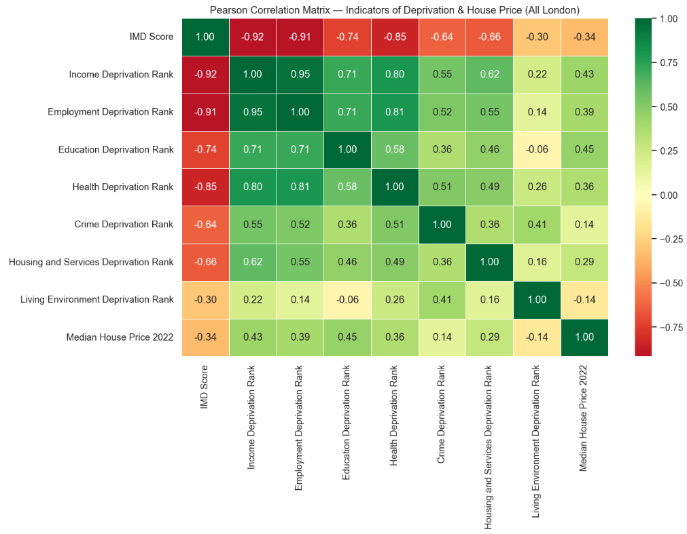
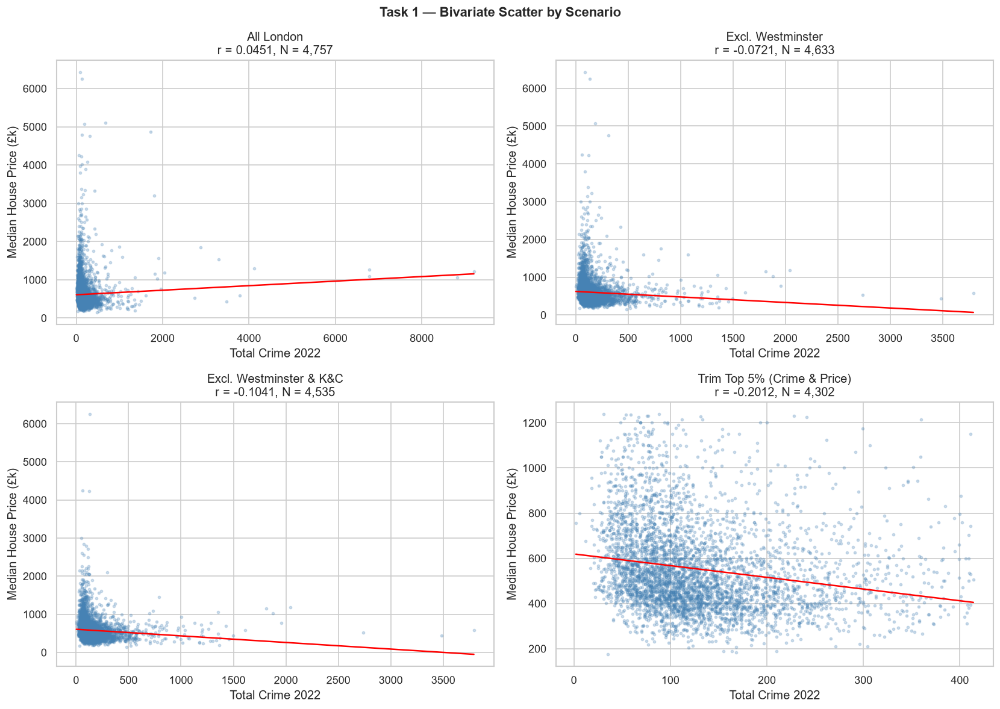
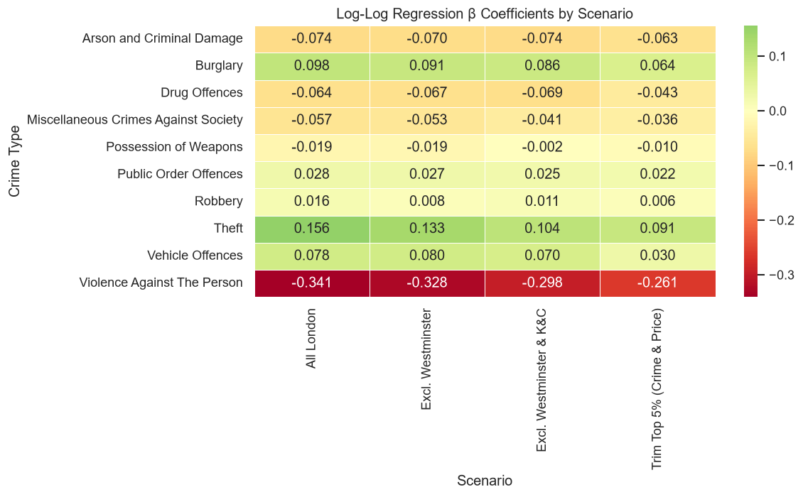

# London House Prices: A Visual Data Story

This visual story shows how geography, poverty, crime, and transport affect London house prices.

---

## 1. The London Map
First, let's see how our main factors are spread geographically across London.

* **Key Takeaway:**
  - Red areas show higher house prices, more crime, and more poverty (deprivation).
  - For public transport, green is best, and red is worst.
  - Expensive houses and best transport are in the center, poverty is higher in East/South-East, and crime clusters in busy central hubs.

---

## 2. Comparing the Totals
Which factor has the strongest link to house prices?

* **Key Takeaway:**
  - **Poverty (IMD, -0.34):** The strongest factor. Higher poverty relates to lower house prices.
  - **Transport (PTAI, +0.18):** Weak positive link. Better transport adds some value.
  - **Total Crime (+0.05):** Shows almost no link. (Let's see why this is misleading below).

---

## 3. Deprivation (Poverty) and House Prices
To justify our claim that poorer areas have cheaper houses, we zoom in on deprivation.

* **Key Takeaway:**
  - Clear downward trend: more deprivation (moving right) equals cheaper house prices (moving down).

We confirm this strength with the correlation matrix:

* **Key Takeaway:**
  - The correlation is **-0.3446**, confirming a statistically significant negative link.

---

## 4. Crime and House Prices
Total crime stats are misleading because of spatial outliers:

* **Key Takeaway:**
  - **Westminster Outlier:** Westminster has extreme crime (tourists) and extreme prices. This distorts the whole London average (Panel A).
  - **Real Trend:** Excluding Westminster and Kensington & Chelsea (Panel B) reveals that higher crime actually relates to lower house prices.

Also, different types of crime have different impacts:

* **Key Takeaway:**
  - **Violence Against the Person (-0.30):** Has the strongest negative link to house prices.
  - **Theft (+0.10):** Positive link because high-value thefts happen in wealthy shopping districts.

---

## 5. Transport and House Prices
Finally, let's check how public transport accessibility (PTAI) connects to prices.

* **Key Takeaway:**
  - Weak upward trend: better transport access gives a price premium, but it is not the main driver of property values.

---

## 6. Conclusion
- **Poverty (deprivation)** is the main visual driver of lower house prices.
- **Safety from violent crime** is highly valued, while total crime stats are distorted by central London shopping hubs.
- **Good transport** is a nice perk, but it does not outweigh the effects of safety and poverty.
