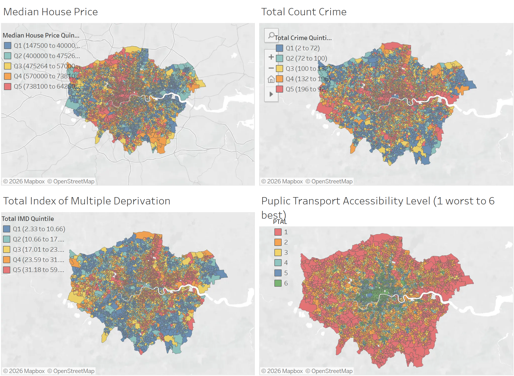
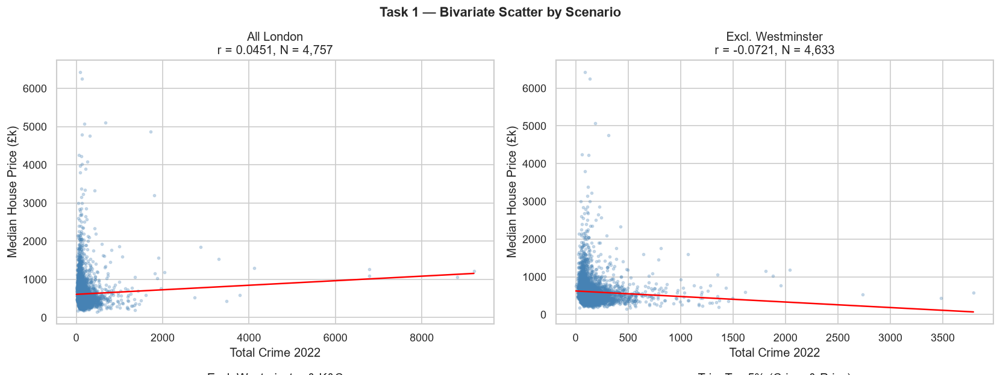
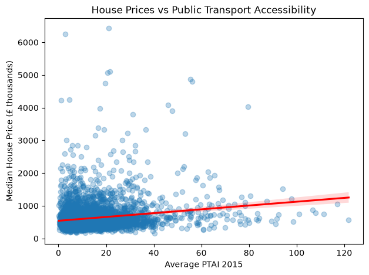
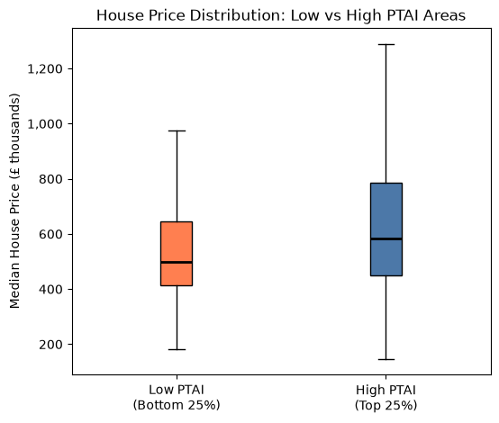
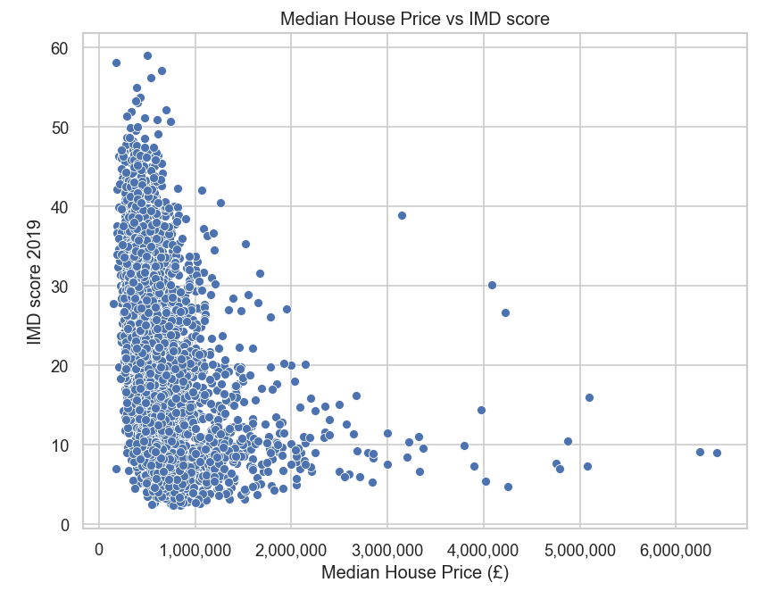

# Understanding What Drives House Prices Across London

London house prices vary considerably between neighbourhoods, making it difficult for homebuyers, investors and policymakers to understand what factors influence property values. While transport links, crime levels and deprivation are all thought to affect housing prices, their relative importance is not always clear. We analysed neighbourhood-level data across London to find out.

## House Prices Across London
We start with the geographical distribution of house prices, crime, deprivation and transport availability across London.

The maps reveal clear geographical patterns across London. House prices are highest in central and western neighbourhoods, while areas with the best transport accessibility are concentrated around central London and major transport corridors. At the same time, deprivation is generally lower in the most expensive areas, suggesting that socioeconomic conditions may play an important role in determining property values.

## Does crime really reduce house prices?

Surprisingly, the answer isn't straightforward. Looking at all London neighbourhoods, crime appears to have almost no relationship with house prices. Several central London areas combine high crime levels with very high property values, reducing the overall correlation (for example Westminster, where crime is high because of tourism and commercial activity rather than residential issues). After these influential areas are excluded, the relationship becomes more clearly negative, suggesting that crime is associated with lower house prices in most neighbourhoods.

## If crime isn't the whole story, could transport explain the difference?

<table>
<tr>
<td width="50%">

</td>
<td width="50%">

</td>
</tr>
</table>

Better transport accessibility is associated with higher house prices, but the relationship is weaker than many people might expect. The scatter plot shows a weak positive trend, while the boxplot highlights the practical difference between neighbourhoods with low and high transport accessibility: the median house price increases from approximately £500,000 in the lowest quartile of PTAI to around £585,000 in the highest quartile. Together, these visualisations suggest that transport adds value, but is only one of several factors influencing house prices.

## Which factor has the greatest influence?

  

Among all the variables analysed, deprivation showed the strongest relationship with house prices. Neighbourhoods with higher deprivation consistently had lower property values, indicating that wider socioeconomic conditions play a greater role than either crime or transport alone.

## Bringing Everything Together

House prices cannot be explained by a single neighbourhood characteristic. While transport accessibility adds value and crime influences prices in some areas, deprivation emerged as the strongest overall indicator of property values. Decisions about housing, regeneration and investment should therefore consider these factors together rather than relying on one measure alone

## Recommendations
**For homebuyers**

Don't rely solely on transport accessibility when choosing where to buy. Consider deprivation, crime and future regeneration plans alongside affordability.

**For investors**

Neighbourhoods benefiting from transport improvements may present investment opportunities, particularly where regeneration is also planned.

**For local authorities**

Transport investment should be accompanied by wider regeneration initiatives, including improvements in safety, local services and neighbourhood quality, to maximise long-term benefits.

Understanding how transport, deprivation and crime interact can support more informed decisions by homebuyers, investors and policymakers when evaluating London's neighbourhoods.

